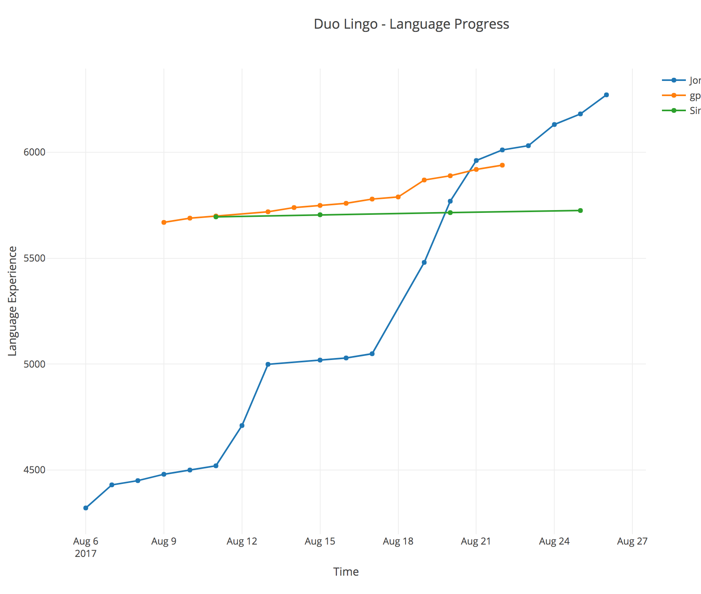

# Duo Lingo Tracker

This module pulls progress data from the duo lingo API and generates a graph of your progress over time.

DuoLingo does not give users a long term graph of progress made by you and the friends you follow.

### Prerequisites

Install the following package managers.

    brew install python
    brew install pip

Install VirtualEnv

    pip install virtualenv

### Installation

#### Create and activate virtual env

    virtualenv duotracker
    source duotracker/bin/activate
    pip install -r requirements.txt

#### To deactivate virtual env

    deactivate

### To run

1. Set environment variables for your Duo Lingo user account:

    DUO_LINGO_USER_NAME=abcxyz1234

    DUO_LINGO_PASSWORD=xxxxxxxxxxxxxxxxxxxx

2. Run

    python duo_lingo_progress.py
